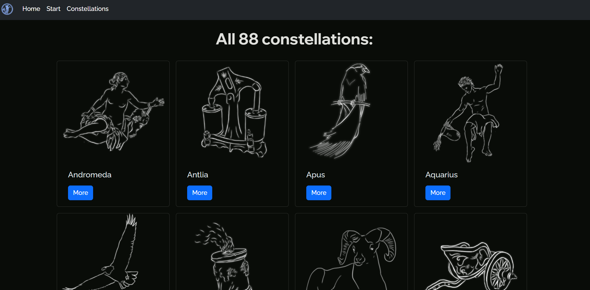

# SkyGaze
*A pet-project i've made to make a tiny dive into modern web techologies.*

Created using:

- **Django** for building web-application
- **MongoDB** for storing data
- **Redis** for server-side caching
- **Bootstrap 5** for nice UI

## Overview
### Home

Home page looks like this:


### Session

To get info for your observation site, enter data in modal window:


After that, you will see a quick overview of your observation site:


And list of constellations visible at observation site and their coordinates:


### Constellations

On this page you can explore 88 constellations:



You can view basic information by clicking "More" button:


## Prerequisites
To run this on your machine, make sure that you have installed:
1. ### Python with following packages:
  - django
  - pymongo
  - datetime
  - httpx
  - selectolax
  - redis

To do this, [install python](https://www.python.org/downloads/) and create a virtual environment in directory with cloned repo using:
```
python -m venv .venv
source .venv/bin/activate
python -m pip install django pymongo datetime httpx selectolax redis
```
2. ### [MongoDB](https://www.mongodb.com/) with [mongodb-tools](https://www.mongodb.com/try/download/database-tools)
3. ### [Redis](https://redis.io/)

## Installation
1. **Clone this repo** in desired folder on your machine:
```
git clone https://github.com/bibrikthesorcerer/SkyGaze
```
3. **Restore MongoDB** database using mongodb-tools:
```
cd SkyGaze/
mongorestore
```

#### After that, you're good to go! To run this application, enter virtual environment, and enter this command in SkyGaze folder:
```
python manage.py runserver
```
